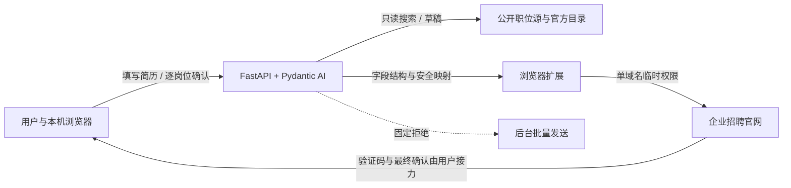

# Resume Campaign Agent / 简历海投辅助器

[](LICENSE)
[](pyproject.toml)

一个基于 **Pydantic AI + FastAPI + Chrome/Edge Manifest V3** 的开源求职工作台。它帮助用户完善结构化简历、审核与优化表达、按方向和 Base 搜索企业岗位、准备岗位版本与申请草稿，并在用户逐岗位授权后由浏览器扩展协助进入官方投递流程。

> 当前为 Alpha。默认内存存储、无账号系统，适合本机或受控网络中的单用户使用。不要把服务 API 直接暴露到公网，也不要使用合成资料向真实招聘网站发送验证码、填写表单或提交申请。

## 能做什么

- 通用简历模板：覆盖基本信息、教育、工作、项目、技能、证书、语言、求职偏好与招聘门户字段。
- 简历审核与优化：完整性、匹配度、成果证据、可信度、表达与结构六维报告；建议不会自动写回，也不得编造经历或数字。
- 岗位与企业发现：结合方向、专业、Base 和资历搜索岗位，优先保留官方渠道并解释匹配依据。
- 求职驾驶舱：JD 解析、一岗一简历、事实审计、岗位排序、渠道去重、进度看板、提醒、面试包、模拟面试、漏斗与风险检查。
- 浏览器副驾驶：单站点按需授权，核验职位、进入申请页、映射空白安全字段、人工接力验证码，并在逐岗位确认且安全检查通过后触发唯一提交按钮。
- 合成档案安全预演：可访问真实官网并停在登录页或申请页边界，不发送验证码、不写入字段、不提交。
- 服务端硬闸门：`POST /api/campaigns/dispatch` 永远返回 `403`；不存在后台静默群发。

## 安全模型



硬性边界：

- 不绕过 CAPTCHA、登录风控或站点访问控制。
- 不读取短信、Cookie、密码、浏览历史或剪贴板，不自动上传附件。
- 不把手机号、邮箱、姓名、验证码或保险箱明文发送给 LLM。
- 不覆盖网页已有值；缺失必填字段、附件、人工声明、CAPTCHA 或歧义提交按钮都会停止流程。
- “已点击”不等于“投递成功”，只有企业官网回执才可确认成功。

完整威胁模型和数据处理说明见 [安全与隐私手册](docs/SECURITY.md)。

## 五分钟启动

要求：Python 3.11+；使用浏览器扩展时需要 Chrome/Edge 116+；运行扩展单元测试需要 Node.js 20+。

```powershell
git clone https://github.com/redmaplewww/resume-campaign-agent.git
cd resume-campaign-agent
py -3.12 -m venv .venv
.\.venv\Scripts\python.exe -m pip install -e ".[test]"
.\.venv\Scripts\python.exe -m resume_campaign_agent
```

Linux/macOS：

```bash
python3 -m venv .venv
. .venv/bin/activate
python -m pip install -e '.[test]'
python -m resume_campaign_agent
```

打开：

- 工作台：<http://127.0.0.1:18010/>
- OpenAPI：<http://127.0.0.1:18010/docs>
- 本机完整演练页：<http://127.0.0.1:18010/browser-fixture>

LLM 是可选项。没有模型配置时，确定性规则、内置企业目录和大部分工作台仍可使用；自然语言 Agent 与部分 AI 排序会安全降级。复制 `.env.example` 为 `.env.local` 后只在本机填写配置，`.env.local` 已被 Git 忽略。

更多说明：[快速开始](docs/QUICKSTART.md) · [浏览器扩展](BROWSER_EXTENSION.md) · [服务器部署](DEPLOY_SERVER.md)

## 测试

```powershell
.\.venv\Scripts\python.exe -m pytest -q
node --test browser_extension/auth-utils.test.js browser_extension/journey-utils.test.js browser_extension/permission-utils.test.js
python scripts/check_public_release.py
```

详细的环境矩阵、API 冒烟、浏览器人工旅程、失败用例和发布回归步骤见 [测试手册](docs/TESTING.md)。所有真实招聘官网测试默认使用合成档案安全预演；测试不得发送验证码或提交申请。

## 文档

| 文档 | 内容 |
|---|---|
| [快速开始](docs/QUICKSTART.md) | 安装、配置、首次合成测试 |
| [架构说明](docs/ARCHITECTURE.md) | 组件、数据流、Pydantic AI 工具与副作用闸门 |
| [API 手册](docs/API.md) | 端点分组、调用示例与错误语义 |
| [测试手册](docs/TESTING.md) | 自动化、浏览器旅程、负向测试、发布验收 |
| [安全与隐私](docs/SECURITY.md) | 数据分类、权限、部署边界与威胁模型 |
| [故障排查](docs/TROUBLESHOOTING.md) | LLM、岗位源、扩展权限、验证码与部署问题 |
| [浏览器扩展](BROWSER_EXTENSION.md) | 安装、权限、认证接力和提交条件 |
| [服务器部署](DEPLOY_SERVER.md) | Docker、SSH 隧道、反向代理与更新 |
| [参与贡献](CONTRIBUTING.md) | 开发流程、提交规范和 PR 检查 |
| [GitHub Actions CI 模板](docs/examples/github-actions-ci.yml) | Python 3.11/3.12 与浏览器扩展持续集成 |

## 项目结构

```text
src/resume_campaign_agent/  FastAPI、Pydantic 模型、Agent 与静态前端
browser_extension/          Chrome/Edge Manifest V3 浏览器副驾驶
tests/                      Python 自动化与合成 fixtures
docs/                       用户、开发、测试和安全手册
deploy/                     systemd、Nginx 与临时隧道示例
scripts/                    发布包与公共仓库检查脚本
```

## 参与与许可证

欢迎提交 Issue 和 Pull Request。请先阅读 [CONTRIBUTING.md](CONTRIBUTING.md) 与 [SECURITY.md](SECURITY.md)。项目采用 [Apache License 2.0](LICENSE)。

本项目是求职辅助工具，不隶属于任何招聘平台或企业。使用者应遵守目标网站条款、隐私规则和适用法律，并对投递内容及最终操作负责。
