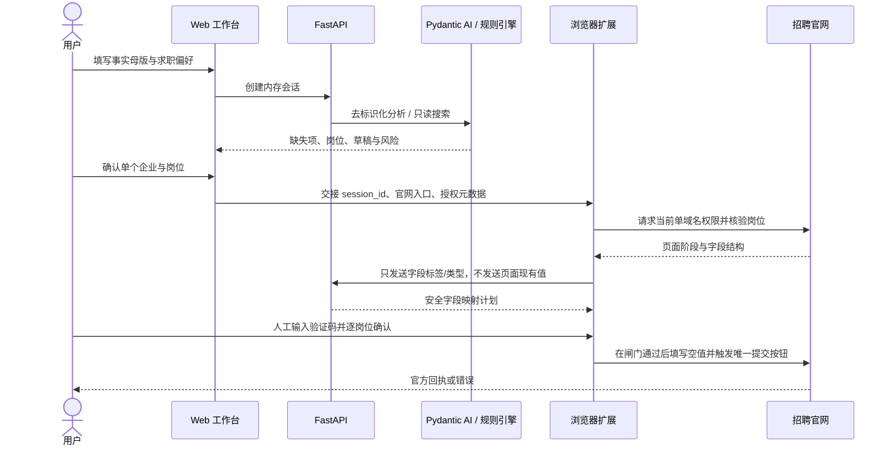

# 架构说明

## 设计目标

Resume Campaign Agent 把“内容建议”和“外部副作用”分开：服务端负责结构化资料、分析、搜索、计划和预检；浏览器扩展只在用户当前可见页面、当前企业和当前岗位范围内执行受控操作。任何不确定状态都按失败关闭处理。

## 组件

| 组件 | 位置 | 职责 |
|---|---|---|
| HTTP 边界 | `api.py` | FastAPI 路由、Pydantic 校验、错误语义、静态前端 |
| 会话与简历 | `models.py`、`store.py` | 结构化事实母版、缺失字段、内存会话 |
| Pydantic AI Agent | `agent.py` | 自然语言补全、只读搜索、投递预览工具编排 |
| 岗位搜索 | `jobs.py`、`discovery.py`、`china_catalog.py` | 公开职位源、官方企业目录、方向/Base 匹配 |
| 简历审核 | `resume_review.py` | 六维审核、去标识化模型上下文、建议稿 |
| Career OS | `career_copilot.py`、`career_models.py` | JD、版本、事实审计、看板、面试、风险与保险箱 |
| 浏览器分析 | `browser_assistant.py` | 字段结构映射、敏感字段阻断、岗位选择 |
| 浏览器副驾驶 | `browser_extension/` | 单站点权限、旅程识别、验证码接力、受控填表与提交 |
| Web 工作台 | `static/` | 单页交互、合成批次、本机浏览器 fixtures |

## 数据流

## Pydantic AI 工具边界

Agent 工具只允许：检查简历、更新用户明确提供的字段、只读搜索岗位、生成 dry-run 预览。服务端 `/api/campaigns/dispatch` 固定拒绝。模型不能直接调用浏览器；浏览器动作必须由页面用户手势触发，并受扩展本地检查约束。

模型上下文会删除直接标识信息。字段映射时模型只看到字段名、标签、类型、选项以及简历中“可用字段名”，真实值由本地服务在确定映射后绑定。

## 三段式副作用闸门

1. **预检**：同源官网、职位仍开放、页面阶段明确、字段签名未变化、无 CAPTCHA/附件/缺失必填/人工声明。
2. **人工放行**：用户确认当前企业和岗位；验证码只能手动输入；最终提交需单独勾选授权。
3. **回执核验**：点击只记录 `triggered`，必须识别官网成功回执才能更新为成功。

合成档案在真实官网中只允许进行第一阶段的只读部分；进入认证页或正式申请表即停止。

## 状态与持久化

当前 `InMemorySessionStore` 适合单进程、单用户开发和演练。进程重启后会话、看板、证据和保险箱全部丢失。多用户部署必须先实现：

- 身份认证和会话隔离；
- 持久数据库与迁移；
- 服务端加密密钥管理与轮换；
- 审计日志脱敏、保留期和删除机制；
- CSRF/限流/代理信任边界；
- 稳定 HTTPS 与备份恢复。

## 扩展点

- 实现 `JobProvider` 可接入经过授权的职位源。
- 扩展 `PortalAdapter` 可增加招聘门户识别规则。
- `InMemorySessionStore` 可替换为持久存储实现。
- LLM 使用 OpenAI 兼容配置，可在不改业务模型的前提下更换提供方。

新增提供方不得通过爬虫绕过登录、访问控制或网站条款；数据来源和权限必须在 PR 中说明。
